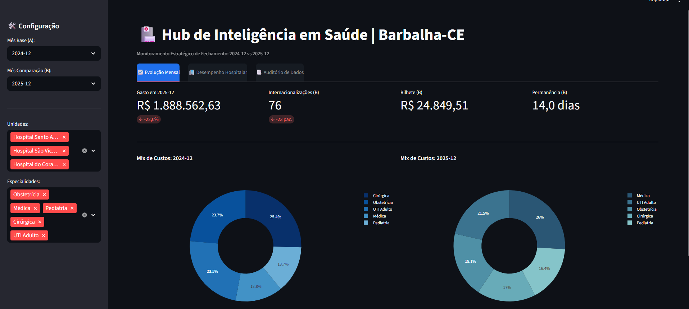
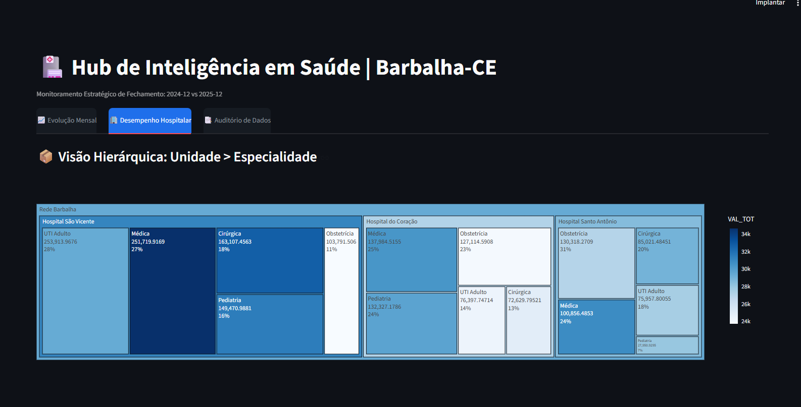
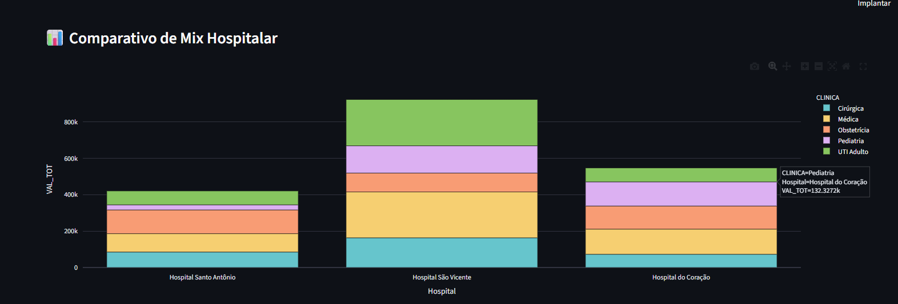
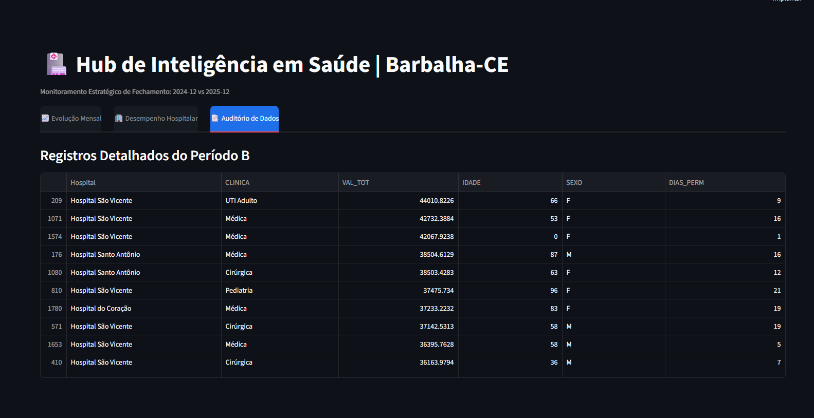

# Hub de Inteligência em Saúde | Barbalha-CE



Este projeto é um ecossistema de **Business Intelligence (BI)** voltado para a gestão e auditoria estratégica de custos hospitalares do SUS na região de **Barbalha, Ceará**.

A ferramenta foi desenvolvida para permitir que gestores de saúde analisem a eficiência financeira e operacional das principais unidades (Hospital São Vicente, Santo Antônio e do Coração), comparando períodos de fechamento entre **2024 e 2025**.

---

## Funcionalidades Principais

* **Comparativo de Fechamento (Delta)**: Análise automática de variação de custos e internações entre dois meses selecionados (Ex: Dez/2024 vs Dez/2025).
* **Gestão de Produção Hierárquica**: Utilização de **Treemaps** e gráficos de rosca para visualizar onde o recurso está sendo alocado (Unidade > Especialidade).
* **Auditoria de Teto**: Monitoramento visual da execução orçamentária de cada hospital.
* **Perfil Epidemiológico**: Filtros dinâmicos para cruzar dados de custos com gênero e faixa etária dos pacientes.

---

## Galeria de Visualizações

### 1. Análise de Desempenho e Especialidades
Visão detalhada da composição de custos usando Treemaps interativos e comparativos de mix de produção entre períodos.




### 2. Auditoria de Registros (Dados Brutos)
Aba dedicada à transparência, permitindo a conferência detalhada de cada internação processada no período selecionado.



---

## Tecnologias Utilizadas

O projeto foi construído com uma stack moderna de Data Science em Python:

* **Python 3.14**: Linguagem base.
* **Streamlit**: Framework para interface web interativa (com personalização CSS para Dark Mode executivo).
* **Pandas**: Motor de ETL (Extração, Transformação e Carga) e simulação de cenários futuros.
* **Plotly Express**: Biblioteca para criação de gráficos dinâmicos e interativos.

---

## Estrutura do Projeto

```text
PROJETO_CUSTOS_SAUDE/
├── assets/             # Imagens e capturas de tela do sistema 
├── data/               # Base de dados CSV (Dados SIH/SUS)
├── src/
│   ├── app_gestao.py   # Código fonte principal do Dashboard
│   └── coleta_dados.py # Script auxiliar de coleta/tratamento
└── README.md           # Documentação do projeto
